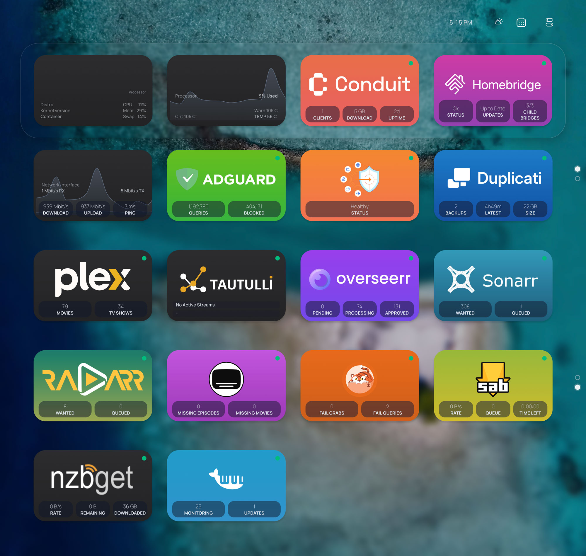

# tvOS-Inspired Homepage Layout

A simple tvOS-style layout for [Homepage](https://gethomepage.dev).
I built this for my own dashboard and decided to share it in case it helps or inspires someone to customize theirs.


## Features

- tvOS-inspired layout and hover behavior  
- Apple TV-style card animation using `marcreichel/apple-tv-card`  
- Top-right Control Center-style dropdown (weather, bookmarks, stats, calendar)  
- Custom service background gradients  
- Optional random Unsplash wallpaper  
- Minimal styling tweaks with Safari compatibility improvements  


## Installation

1. Install and configure Homepage normally by following the official documentation:  
   https://gethomepage.dev
2. Copy everything from this repository into your Homepage config directory.
3. Restart Homepage.


## Custom Service Backgrounds

Set custom gradient backgrounds per service in `custom.css`:
```css
li[data-name="YOUR SERVICE NAME"] {
  --bg-colors: color1, color2;
}
```

## Unsplash Random Wallpaper (Optional)

You can enable random background images from an Unsplash collection on each refresh.
In `custom.js`, replace the placeholder with:
- Your Unsplash API key
- Your collection ID
You can still use a static background in `settings.yaml` if you prefer.

## control-center.js & Local Icons

If you want to use custom control center and local icons:
1. Create a Docker mount to:
   ```
   /app/public/icons
   ```

2. Reference your icons like this:
   ```
   /icons/myicon.svg
   ```

3. Restart the container after adding new icons.

## Screenshots



## Credits

- Homepage — https://gethomepage.dev  
- Apple TV Card animation — https://github.com/marcreichel/apple-tv-card
- [Conduit widget](./conduit-widget.md) - https://github.com/ssmirr/conduit
- Duplicati widget - https://wsj-br.github.io/duplistatus/user-guide/homepage-integration
